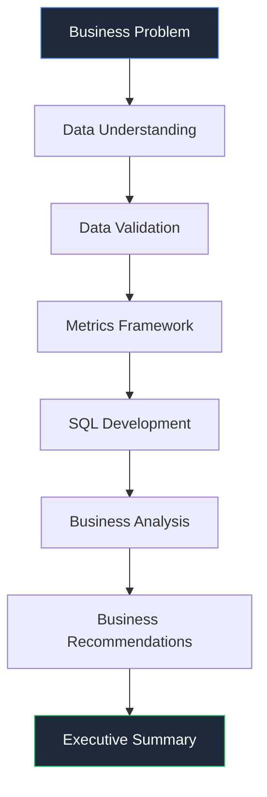
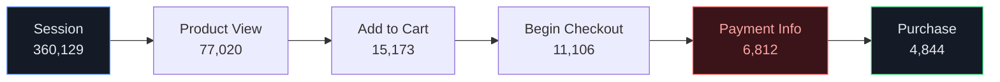
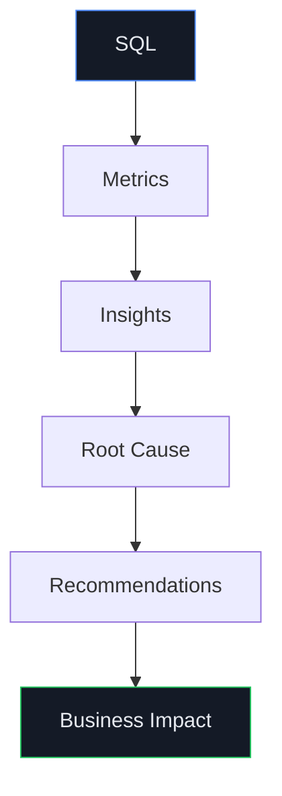
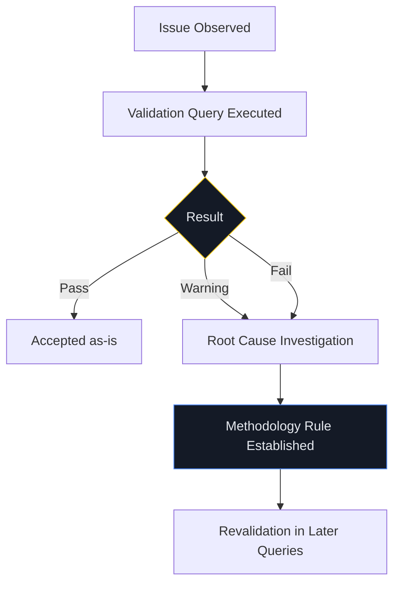

<div align="center">

# 📊 Google Merchandise Store — Product Analytics Engagement

### An end-to-end Product Analytics case study on GA4 BigQuery data — from raw event schema to validated SQL to executive strategy.

[](sql/)
[](docs/02_Data_Understanding.md)
[](docs/04_Metrics_Framework.md)
[](docs/06_Analysis.md)
[](docs/)
[](docs/03_Data_Validation.md)
[](LICENSE)

</div>

---

## 📌 Project Description

This repository is a complete, production-style Product Analytics engagement built on the **GA4 BigQuery public sample dataset** for the Google Merchandise Store. It is not a SQL tutorial and not a dashboard demo — it is a full analytics lifecycle: business framing → data understanding → validation → metrics design → 54 executed SQL queries → executive analysis → strategic recommendations → board-level briefing → a durable decision log.

Every number in every document traces back to an executed query. Every methodology decision is documented and justified. Where evidence didn't exist (e.g. geographic performance), this project says so explicitly rather than inventing a finding.

---

## 🎯 Business Problem

The Google Merchandise Store converts visitors and processes revenue normally — but does it retain any of them? Leadership needs to know **where the business loses customers, which segments actually drive value, and what to do about it next quarter.** This engagement answers that with evidence, not intuition.

## 🎯 Business Objectives

1. Identify where users drop off between landing and purchase.
2. Determine which acquisition channels bring back valuable, repeat traffic.
3. Identify which segments (device, geography, channel, customer tier) disproportionately drive revenue.
4. Establish whether this store retains customers or is a one-time-purchase brand vehicle.
5. Convert every finding into owned, prioritized, KPI-linked business recommendations.

---

## 🗃️ Dataset Overview

| Attribute | Detail |
|---|---|
| Source | [`bigquery-public-data.ga4_obfuscated_sample_ecommerce`](https://console.cloud.google.com/bigquery?p=bigquery-public-data&d=ga4_obfuscated_sample_ecommerce) |
| Grain | One row = one event (not a user, session, or transaction) |
| Window | 92 days — Nov 1, 2020 to Jan 31, 2021 |
| Volume | 4,295,584 events · 270,154 users · 360,129 sessions |
| Schema | Nested GA4 export — `event_params`, `items`, `device`, `geo`, `traffic_source`, `ecommerce` structs |

Full field-by-field documentation: **[`docs/02_Data_Understanding.md`](docs/02_Data_Understanding.md)**

---

## 📂 Repository Structure

```
.
├── README.md                          ← You are here
├── LICENSE
├── docs/                               9-stage analytical narrative, read in order
│   ├── 01_Project_Overview.md          Business framing, objectives, scope
│   ├── 02_Data_Understanding.md        Schema, data dictionary, nested-field deep dive
│   ├── 03_Data_Validation.md           23 executed checks — PASS/WARNING/FAIL
│   ├── 04_Metrics_Framework.md         26 metrics across 11 categories
│   ├── 05_SQL_Query_Repository.md      54 queries, executed + interpreted
│   ├── 06_Analysis.md                  18-section executive analysis report
│   ├── 07_Business_Recommendations.md  13 prioritized, owned recommendations
│   ├── 08_Executive_Summary.md         Board briefing + interview talking points
│   └── 09_Analytics_Decision_Log.md    R1–R7 rule registry, open items
├── sql/                                 Same 54 queries as raw, browsable .sql files
│   ├── 01_north_star_and_acquisition.sql
│   ├── 02_activation_and_engagement.sql
│   ├── 03_commerce_and_funnel.sql
│   ├── 04_retention_and_customer.sql
│   ├── 05_product_and_marketing.sql
│   └── 06_executive_and_validation.sql
└── assets/dashboards/                   7 enterprise-style dashboard mockups (1920×1080)
    ├── 01_Executive_Overview.png
    ├── 02_Acquisition_Activation.png
    ├── 03_Funnel_Analytics.png
    ├── 04_Revenue_Product.png
    ├── 05_Customer_Retention.png
    ├── 06_Marketing_Performance.png
    └── 07_Data_Quality_Analytics.png
```

**Why this structure:** `docs/` is the analytical narrative — read top to bottom, it mirrors how a real Analytics team actually works, not how a report gets written after the fact. `sql/` exists separately so the actual SQL is skimmable without wading through prose. `assets/` holds visual artifacts only — no folder in this repo exists for decoration.

> **Note on the dashboard mockups:** these are hand-built HTML/CSS design-system pages rendered to PNG (via `wkhtmltoimage`), not screenshots of a live Power BI/Tableau/Looker instance. Every number on them traces to a query in `sql/`. Stated here plainly, in the interest of the same honesty this project applies to its data findings.

---

## 🛠️ Tech Stack

- **Data Warehouse:** Google BigQuery (GA4 export schema, nested STRUCT/ARRAY, `UNNEST`, correlated subqueries)
- **Language:** GoogleSQL (Standard SQL)
- **Documentation:** Markdown, Mermaid diagrams
- **Visualization:** HTML/CSS design system → static dashboard mockups (BI-tool-agnostic by design; portable to Power BI, Tableau, Looker, Sigma, or Mode)

---

## 🔄 Project Workflow



## 🧭 Analytics Methodology


Every stage in this chain **feeds forward and corrects backward** — the SQL stage discovered two additional data-quality rules (R6, R7) that validation alone hadn't surfaced, and both were folded back into the methodology before the analysis stage began. See **[`09_Analytics_Decision_Log.md`](docs/09_Analytics_Decision_Log.md)** for the full audit trail.

---

## 📐 Metrics Framework

26 metrics across 11 categories — North Star, Acquisition, Activation, Engagement, Commerce, Funnel, Retention, Customer, Product, Marketing, and an Executive Scorecard rollup. Every metric definition specifies its **business purpose, executive owner, grain, SQL logic, and common mistakes** before any query implementing it was written.

| Category | Example Metric | Grain |
|---|---|---|
| North Star | Weekly Transacting Users | User (weekly) |
| Funnel | View-to-Purchase Conversion | Session |
| Revenue | Average Order Value | Transaction |
| Retention | Day N Retention | User (cohort) |
| Customer | Value Tier Segmentation | User |

Full definitions: **[`docs/04_Metrics_Framework.md`](docs/04_Metrics_Framework.md)**

---

## 💻 SQL Highlights

54 production queries, each mapped to a specific metric, executed against live BigQuery data, and validated against real (not assumed) output. A representative example — the session-scoped funnel query that overturned a naive event-level estimate by 27 points:

```sql
-- Query 6.2 — Cart-to-Checkout Rate (Session-Scoped)
-- Naive event-level ratio (58,543 add_to_cart / 38,757 begin_checkout) suggested ~66%.
-- Session-scoped reality, below, told a very different story.
WITH session_flags AS (
  SELECT
    CONCAT(user_pseudo_id, '-',
      CAST((SELECT value.int_value FROM UNNEST(event_params) WHERE key = 'ga_session_id') AS STRING)
    ) AS session_key,
    MAX(IF(event_name = 'add_to_cart', 1, 0)) AS added_to_cart,
    MAX(IF(event_name = 'begin_checkout', 1, 0)) AS began_checkout
  FROM `bigquery-public-data.ga4_obfuscated_sample_ecommerce.events_*`
  GROUP BY session_key
)
SELECT
  ROUND(SUM(IF(added_to_cart=1 AND began_checkout=1,1,0)) * 100.0 / SUM(added_to_cart), 2)
  AS cart_to_checkout_rate_pct
FROM session_flags;
-- Result: 39.25% — a 27-point gap from the naive estimate, caused by event-vs-session grain mismatch.
```

Full repository: **[`docs/05_SQL_Query_Repository.md`](docs/05_SQL_Query_Repository.md)** (interpreted) · **[`sql/`](sql/)** (raw, browsable)

---

## 🔻 Customer Funnel



**The steepest single drop is Payment Info entry (38.65% loss)** — not the final purchase step. This single finding redirected the entire checkout-optimization recommendation away from a generic "reduce abandonment" initiative toward a specific, evidenced payment-UX fix.

---

## 🔑 Key Business Insights

1. **Only 19.97% of first-time visitors ever view a product** — the largest, earliest leak in the entire journey, upstream of the funnel entirely.
2. **82.47% of users are single-session; Day 30 retention is 0.13%** — this is a brand-engagement vehicle, not a repeat-revenue business, as a matter of measured fact.
3. **0.43% of users (1,161 people) drive ~62% of measured customer value** — with no dedicated program built around them.
4. **A privacy-redacted traffic segment converts 2.8x better than the next-best channel** — the store's best-performing segment is currently invisible to standard reporting.
5. **Paid search underperforms every free channel simultaneously** — lower conversion, lower engagement, and a revenue share below its own session share.

Full findings: **[`docs/06_Analysis.md`](docs/06_Analysis.md)**

---

## 🧩 Business Decision Flow



## 📋 Executive Recommendations

| Recommendation | Owner | Priority | Timeline |
|---|---|---|---|
| Data & Reporting Integrity Lockdown | Analytics/Engineering | Critical | Month 1 |
| Homepage & Navigation Activation Redesign | Product | Critical | Month 2–3 |
| Checkout Payment-Step UX Fix | Product/Engineering | Critical | Month 2–3 |
| Past-Purchaser Loyalty Program | Marketing/CRM | High | Month 2–3 |
| High-Value Tier Profiling & VIP Program | Analytics/Marketing | High | Month 1 (profile) → 6–12mo |
| `(data deleted)` Segment Investigation | Analytics/Legal/Marketing | High | Month 1–3 |

Full roadmap, ROI/effort matrix, and department-level plan: **[`docs/07_Business_Recommendations.md`](docs/07_Business_Recommendations.md)**

## 💼 Business Impact

This engagement reframes the business's core constraint — from "fix checkout" (the default assumption) to "fix activation" (only 19.97% of new visitors ever reach a product page) — while surfacing two proven, under-activated value pools (past purchasers, the top 0.43% customer tier) worth more than another marketing-budget increase at current blended efficiency.

---

## ✅ Validation Methodology



**23 checks executed** — 14 Pass (61%), 5 Warning (22%), 4 Fail (17%). Every FAIL produced a documented, permanent methodology rule (R1–R7) rather than a silent patch. Full results: **[`docs/03_Data_Validation.md`](docs/03_Data_Validation.md)**

---

## ⚠️ Known Limitations

- Public, obfuscated sample dataset — findings are directional, not literal statements about the real store's performance.
- 85.74% of events carry `debug_mode=1` (R1) — included, not filtered, since exclusion would gut the dataset; confirmed uniform across channels.
- No refund events exist in this GA4 implementation — reported as an absence of tracking, not a 0% refund rate.
- Geographic analysis was never executed — an acknowledged scope gap, not a finding.
- `item_id` cannot be used as a cross-event join key in this dataset (R7) — `item_name` used instead throughout.

Full registry: **[`docs/09_Analytics_Decision_Log.md`](docs/09_Analytics_Decision_Log.md)**

---

## 🧠 Skills Demonstrated

`Product Analytics` `Business Analytics` `Growth Analytics` `SQL (Nested/Semi-Structured Data)` `GA4 BigQuery Export Schema` `Funnel Analysis` `Cohort & Retention Analysis` `Customer Segmentation` `Revenue Analytics` `Marketing Attribution` `Data Validation & QA` `Metrics Design` `Executive Communication` `Root Cause Analysis` `Strategic Recommendation Writing`

---

## 🎤 Interview Talking Points

- *"What's the hardest SQL problem you solved?"* — The `item_id` join failure (R7): a first fix attempt returned 100% "Unmapped," which told me the problem was deeper than assumed; switching to `item_name` resolved it and confirmed the root cause empirically.
- *"What's the biggest business insight?"* — The real constraint is upstream of the funnel entirely: only 19.97% of new visitors ever view a product. Most naive analyses of this dataset jump straight to "optimize checkout."
- *"How do you handle a finding that contradicts your hypothesis?"* — Directly: my cross-session cart-persistence hypothesis was mostly wrong (Q6.6) — I corrected the conclusion rather than keeping the more convenient original story.

Full set of 20 questions and answers: **[`docs/08_Executive_Summary.md`](docs/08_Executive_Summary.md#9-interview-talking-points)**

---

## 🚀 Future Improvements

- Geographic (country/region) performance analysis — explicitly descoped, lowest-effort next step given confirmed clean `geo.country` data.
- Marketing attribution modeling beyond last-touch/session-scoped.
- Formal A/B testing infrastructure to support the homepage and checkout recommendations.
- Market basket / cross-sell affinity analysis using the `items` array.
- CLV cohort modeling beyond the current within-window LTV snapshot.

Full list, explicitly marked as out-of-scope future work: **[`docs/07_Business_Recommendations.md` §12](docs/07_Business_Recommendations.md)**

---

## 👤 About the Author

Built as a flagship, portfolio-grade Product Analytics case study — demonstrating the full lifecycle a Senior Product Analyst, Business Analyst, or Analytics Consultant is expected to own end-to-end: business framing, data validation, metrics design, SQL execution, executive storytelling, and strategic recommendation.

## 📬 Contact

Open an issue on this repository, or connect via the profile associated with this GitHub account.

## 📄 License

Released under the [MIT License](LICENSE). The underlying dataset is Google's public `ga4_obfuscated_sample_ecommerce` BigQuery sample, subject to its own [terms](https://cloud.google.com/bigquery/public-data).

---

<div align="center">

**[📁 Start Reading → 01 Project Overview](docs/01_Project_Overview.md)**

</div>
